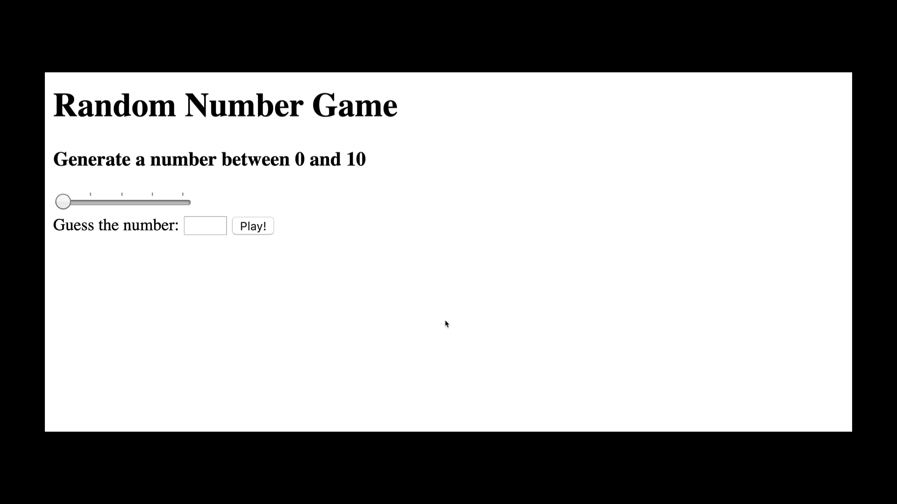

## Languages

## Conditions for Challenges

✅ Find a  random number on a range between 0 and a number defined by the user.    
✅ Use range input.  
✅ Update the range value in real time.  
✅ Only play after the user chooses a number.  
✅ Notify the user if the game is lost or won.  
✅ Don't give up.

## Demo

## Result(Custom)

